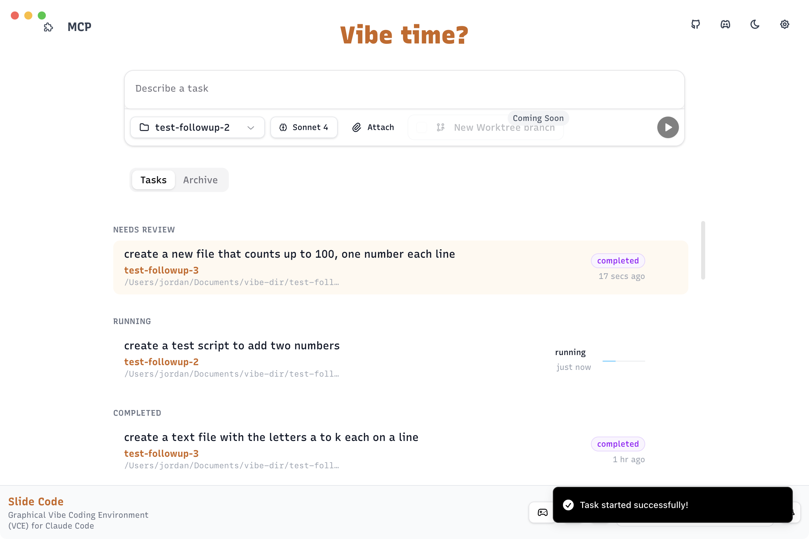
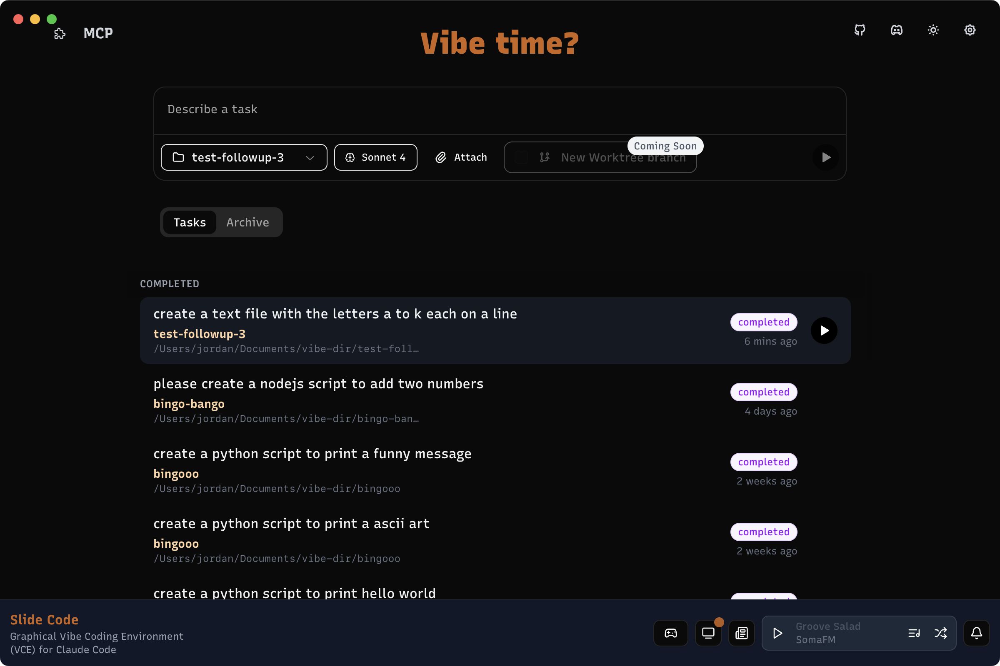
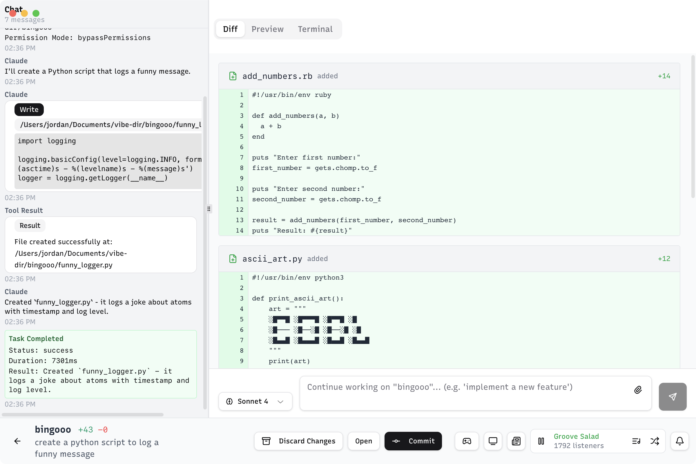
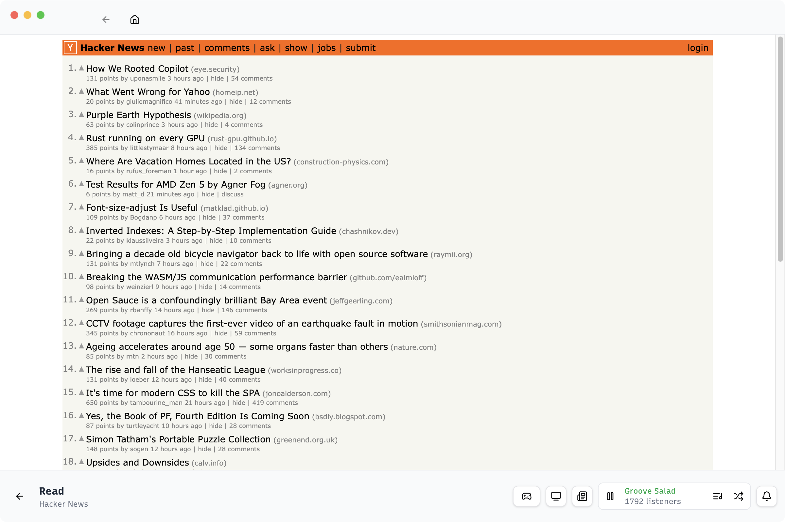
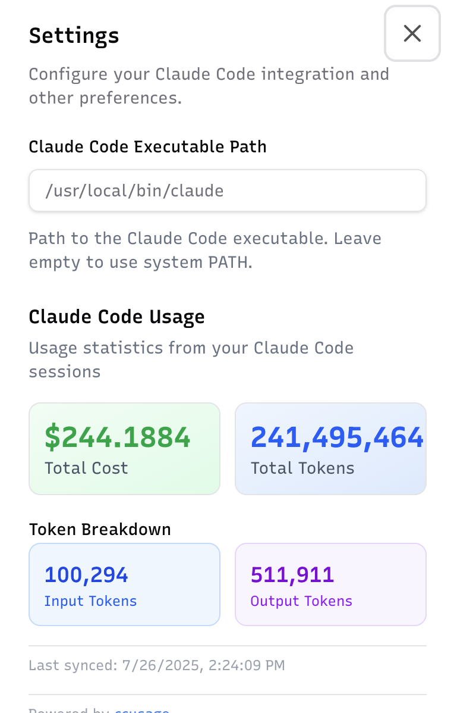
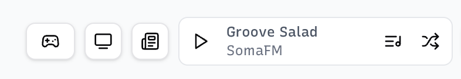
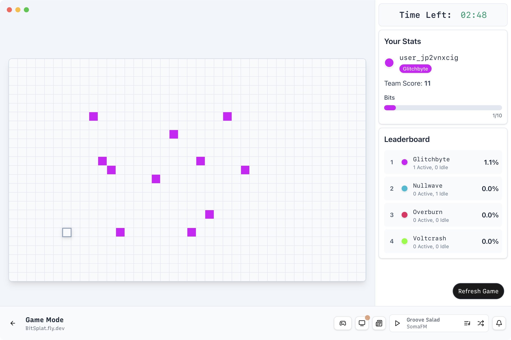
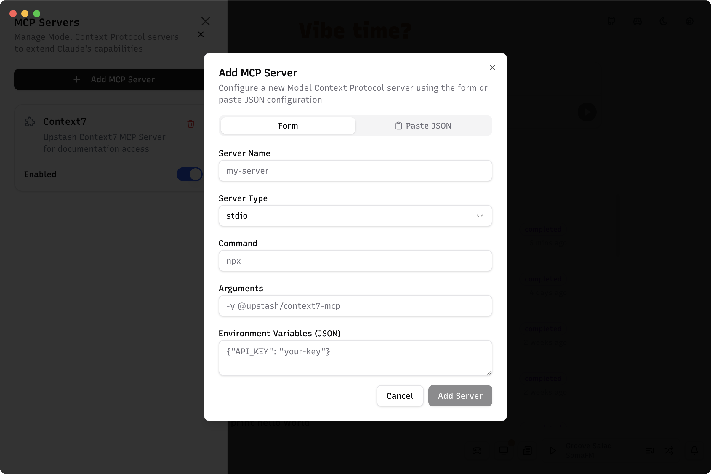

# Slide Code

**A Graphical Vibe Coding Environment (VCE) for Claude Code**

[Join our Discord](https://discord.gg/2RgudA7g) • [View All Releases](https://github.com/longtail-labs/slide.code.releases/releases/latest) • [📥 Download](https://longtail-labs.github.io/slide.code/download.html)

## 📥 Downloads

<div align="center">

[-Download-blue?style=for-the-badge&logo=apple&logoColor=white)](https://slide-code-downloader.internal-slide.workers.dev/mac-silicon) [-Download-blue?style=for-the-badge&logo=apple&logoColor=white)](https://slide-code-downloader.internal-slide.workers.dev/mac-intel) [](https://slide-code-downloader.internal-slide.workers.dev/windows)

</div>

---

## 📸 Screenshots

<div align="center">
  
  ### 🎯 Main Interface
  
  
  <p><em>Action Bar - Command Center</em></p>
  
  <br/>
  
  
  <p><em>Home - Light Mode</em></p>
  
  <br/>
  
  ### 🎨 Features & Modes
  
  <table>
    <tr>
      <td width="50%">
        
        <p align="center"><em>Home - Dark Mode</em></p>
      </td>
      <td width="50%">
        
        <p align="center"><em>Claude Code Working</em></p>
      </td>
    </tr>
    <tr>
      <td width="50%">
        
        <p align="center"><em>Watching TBPN while coding</em></p>
      </td>
      <td width="50%">
        
        <p align="center"><em>Reading Mode</em></p>
      </td>
    </tr>
    <tr>
      <td width="50%">
        
        <p align="center"><em>Settings and Usage</em></p>
      </td>
      <td width="50%">
        
        <p align="center"><em>Playtime</em></p>
      </td>
    </tr>
    <tr>
      <td width="50%">
        
        <p align="center"><em>Game Mode</em></p>
      </td>
      <td width="50%">
        
        <p align="center"><em>MCP Integration</em></p>
      </td>
    </tr>
  </table>
  
</div>

Slide Code is a intuitive desktop application that ideally makes it a bit easier to run multiple Claude Code agents at once

## 🏗️ Tech Stack

### **Desktop Application**

- **[Electron](https://www.electronjs.org/)**: Cross-platform desktop framework
- **[React](https://reactjs.org/)**: Modern UI library with hooks
- **[TypeScript](https://www.typescriptlang.org/)**: Type-safe JavaScript
- **[Effect-TS](https://effect.website/)**: Functional programming for robust async operations
- **[Drizzle ORM](https://orm.drizzle.team/)**: Type-safe database operations
- **[SQLite](https://www.sqlite.org/)/[Turso](https://turso.tech/)**: Local and cloud database support
- **[shadcn/ui](https://ui.shadcn.com/)**: Beautiful, accessible UI components
- **[Tailwind CSS](https://tailwindcss.com/)**: Utility-first CSS framework
- **[ccusage](https://github.com/ryoppippi/ccusage)**: Claude Code usage tracking
- **[Hydraulic Conveyor](https://hydraulic.dev/)**: Desktop app distribution, simplified
- **[Claude Code SDK](https://github.com/anthropics/claude-code)**: Official SDK for Claude Code integration

### **Game** (`/game`)

- **[Go](https://golang.org/)**: High-performance backend language
- **[Templ](https://templ.guide/)**: Type-safe HTML templating
- **[Datastar](https://data-star.dev/)**: Reactive frontend framework
- **[NATS.io](https://nats.io/)**: Cloud-native messaging system

## ✨ Features

### 🎯 **Effortless Project Management**

- **One-Click Project Creation**: Create new projects instantly or select existing ones, no Github integration required
- **Vibe Directory**: New projects get placed into a specified directory
- **Multi-Task Execution**: Run multiple Claude Code tasks simultaneously 
- **Session Persistence**: Resume your coding sessions anytime, anywhere

### 🎵 **Vibe While You Code**

- **Integrated Music Player**: Stream from SomaFM while coding 
- **TBPN Channel**: Keep up to date with the latest tech news directly in the VCE
- **Hacker News Reader**: Keep up to date with the latest tech news without leaving your flow
- **Play a massive multiplayer game**: Play a Splatoon inspired multiplayer game where you compete automatically to take over the grid

### 🔧 **Powerful Development Tools**

- **Real-time Diff Viewer**: See exactly what changes Claude Code is making
- **Git Integration**: Quickly commit your (AI generated) changes
- **Task Tracking**: Monitor multiple concurrent tasks
- **Notifications**: Get native OS alerts when tasks complete, fail, or are cancelled
- **Comment System**: Add notes and feedback directly to your diffs
- **Usage Analytics**: Track your Claude Code usage, costs, and token consumption at a glance

### 🎨 **Beautiful UI/UX**

- **Modern Design**: Clean, intuitive interface built with shadcn/ui
- **Dark/Light Mode**: Switch themes to match your preference

## 🚀 Quick Start

### Prerequisites

- **Claude Code CLI**: Follow the setup guide at [docs.anthropic.com/en/docs/claude-code/setup](https://docs.anthropic.com/en/docs/claude-code/setup)

### Getting Started

1. **Launch Slide Code**: Open the application after installation
2. **Create or Select a Project**: 
   - Click "Create New Project" for a fresh start
   - Or "Select Existing Project" to work with existing code
3. **Give it a Prompt**: Describe what you want to build
4. **Watch the Magic**: Claude Code starts working while you vibe to your favorite tunes


## 🔄 Roadmap

### **Coming Soon**

- [ ] **Git Worktrees**: Isolated development branches
- [ ] **Plugin System**: Extend functionality with custom plugins
- [ ] **Team Collaboration**: Share projects and sessions
- [ ] **MCP Powered Game**: Write code and control bots that play the game while coding

## 🛠️ Development

### **Quick Start**

```bash
# Clone the repository
git clone https://github.com/longtail-labs/slide.code
cd slide-code

# Install dependencies
npm install

# Start the Electron app
npm run start:app
```

### **Architecture Overview**

```bash
slide-code/
├── apps/                 # Electron main & preload processes
├── packages/
│   ├── clients/         # API clients & React hooks
│   ├── core/            # Core business logic with Effect-TS
│   ├── db/              # Database layer with Drizzle ORM
│   └── schema/          # Type definitions & schemas
├── widgets/app/         # React frontend (main UI)
├── game/               # Go game server (BitSplat)
└── bundled_modules/    # Native dependencies (LibSQL)
```

### **🏗️ Architecture Benefits**

This Electron app setup provides several developer experience advantages:

#### **⚡ Instant Hot Reload**

- Uses Vite dev server for instant React/UI changes without restart
- Frontend code in [`widgets/app/`](widgets/app/) refreshes immediately
- Electron app loads from Vite in development mode ([`packages/core/src/flows/app.flow.ts:93-102`](packages/core/src/flows/app.flow.ts#L93))

#### **🔒 Type-Safe IPC Boundary**

Built with Effect.ts for robust cross-process communication:

- **PubSub Pattern** ([`packages/clients/src/pubsub/`](packages/clients/src/pubsub/)): Event-based messaging for notifications and updates across main/renderer boundary
- **RPC Pattern** ([`packages/core/src/rpc/`](packages/core/src/rpc/)): Type-safe remote procedure calls similar to tRPC, enabling request-response patterns between processes
- **IPCRef Pattern** ([`packages/core/src/services/ipc-ref.service.ts`](packages/core/src/services/ipc-ref.service.ts)): Shared state management like Zustand but works across process boundaries with automatic synchronization

#### **🎯 Additional Notable Features**

- **Effect.ts Integration**: Functional programming patterns for better error handling and composability
- **Dependency Injection**: Effect.ts makes DI trivial - services are automatically provided through layers, making testing and modularity seamless
- **Cross-IPC Database Access**: Direct Drizzle queries from renderer ([`packages/clients/src/drizzle/`](packages/clients/src/drizzle/), [`packages/core/src/rpc/handlers.ts:828-840`](packages/core/src/rpc/handlers.ts#L828)) using [Drizzle HTTP Proxy](https://orm.drizzle.team/docs/connect-drizzle-proxy)
- **Smart Data Syncing**: TanStack Query can be invalidated from main process ([`packages/schema/src/queryKeys.ts`](packages/schema/src/queryKeys.ts), [`packages/clients/src/tanstack/index.ts:71-78`](packages/clients/src/tanstack/index.ts#L71), [`packages/core/src/services/pubsub.service.ts:153-205`](packages/core/src/services/pubsub.service.ts#L153)), enabling automatic UI updates when backend data changes
- **Secure Context Bridge**: Preload scripts carefully expose only safe APIs to renderer
- **Automatic State Persistence**: IPCRef supports optional persistence to disk with rehydration on app start

### **Development Commands**

#### **Electron App**

```bash
npm install              # Install all dependencies
npm run start:app       # Start Electron app in development
npm run build           # Build for production
```

#### **Game Server**

```bash
cd game
make setup              # Install Go tools and dependencies
make dev                # Start development server with hot reload
make build              # Build production binary
make clean              # Clean build artifacts
```

#### **Database**

```bash
npm run db:migrate:generate  # Generate new migration
npm run db:migrate:apply     # Apply migrations
npm run studio              # Open Drizzle Studio
```

### **Development Workflow**

1. **Start the Electron app**: `npm run start:app`
2. **Start the game server** (optional): `cd game && make dev`
3. **Make changes**: Edit files in `widgets/app/src/` for UI, `packages/core/src/` for logic
4. **Hot reload**: Changes automatically reload in development


## 🔨 Building Locally

### **Prerequisites**

- Node.js 22+ (required)
- macOS, Windows, or Linux
- [Hydraulic Conveyor](https://hydraulic.dev/) (for distribution builds)

### **Local Build Instructions**

1. **Install Dependencies**
   ```bash
   npm install
   ```

2. **Build the Application**

   ```bash
   # For production build
   npm run build:prod
   
   # For beta build
   npm run build:beta
   ```

4. **Process the build**

  ```bash
  # For production build
  npm run make:prod

  # For beta build
  npm run make:beta
  ```

4. **Build with Conveyor**
   
   ```bash
   # Build for local testing (uses conveyor.local.conf)
   npm run compile:local
   
   # The built application will be in /output. Move the app to your Applications folder to test
   ```

### **Nightly Beta Releases**

The project supports automated nightly beta releases via GitHub Actions:
- Beta builds use [`conveyor.beta.conf`](conveyor.beta.conf) for configuration
- Automatically published to the beta release channel
- Separate app ID and branding from production releases

## 🤝 Contributing

Contributing to Slide Code is straightforward thanks to our strongly-typed architecture:

### **Type-Safe Development**

The entire codebase is strongly typed across the IPC boundary, making it hard to introduce runtime errors:
- **TypeScript everywhere**: From main process to renderer, all code is type-checked
- **Effect.ts schemas**: Ensure data integrity across process boundaries
- **Build-time validation**: Running `npm run build` will catch most issues before runtime

### **Quick Contribution Guide**

1. Fork the repository and clone your fork
2. Install dependencies: `npm install`
3. Make your changes
4. Run the build: `npm run build`
5. Test your changes: `npm run start:app`
6. Submit a pull request

The strong typing means if your code compiles, it's likely to work correctly!

## 📄 License

This project is licensed under the MIT License - see the [LICENSE](LICENSE) file for details

## 🌟 Support

- ⭐ **Star this repo** if you find it useful
- 🐛 **Report bugs** via GitHub Issues
- 💬 **Chat with us & Request features** on [Discord](https://discord.gg/2RgudA7g)
- 🐦 **Follow me** on Twitter [@jonovono](https://x.com/jonovono)
